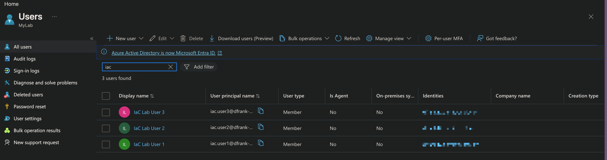
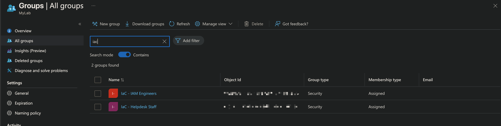
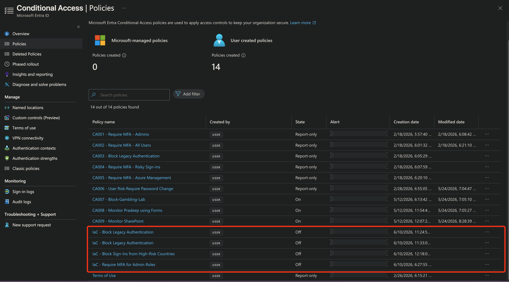
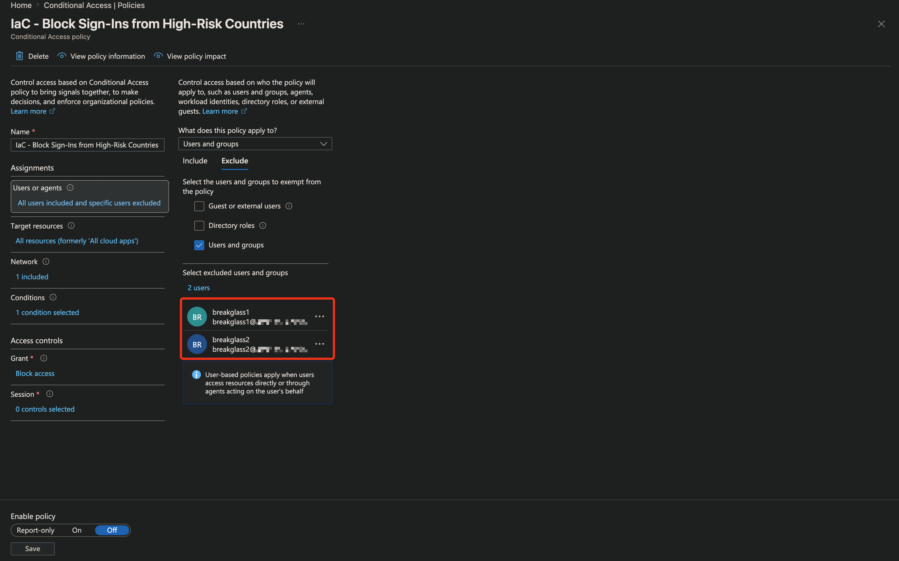
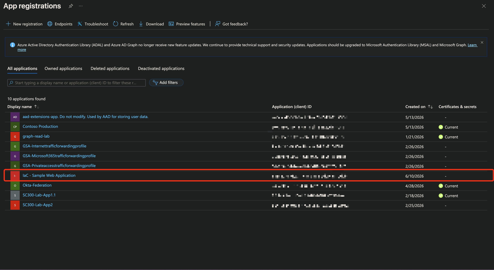
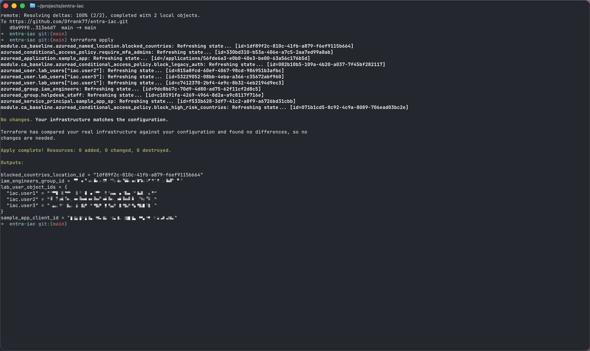

# entra-iac

Terraform-based Infrastructure-as-Code for Microsoft Entra ID identity objects.

## Overview

This project demonstrates declarative provisioning of Entra ID resources using the `hashicorp/azuread` Terraform provider. Resources include users, security groups, conditional access policies, named locations, and application registrations.

## Screenshots

### Users (provisioned via Terraform `for_each`)


### Groups with declarative membership### Break-glass exclusion on block policy


### Conditional Access policies list


### Break-glass exclusion on block policy


### Named location with country list
## Country codes managed via variable

\```hcl
# From conditional-access.tf
module "ca_baseline" {
  source                = "./modules/ca-baseline"
  blocked_country_codes = ["KP", "IR", "RU", "BY", "CN"]
}
\```

### App registration with Microsoft Graph permissions


### Terraform apply output


## Resources Managed

- Users with job titles and department metadata
- Security groups with declarative membership
- Conditional Access policies (legacy auth block, admin MFA, geo-blocking)
- Named locations (country-based)
- Application registrations with Microsoft Graph API permissions
- Service principals

## Architecture Patterns Demonstrated

- Cross-resource dependencies (groups referencing users, CA policies referencing named locations)
- Built-in directory role targeting via fixed object IDs
- App registration + service principal pairing
- Conservative defaults (CA policies created in `disabled` state for safe promotion)

## Authentication

Uses Azure CLI authentication via `az login`. Provider picks up cached credentials automatically.

## Usage

```bash
terraform init
terraform plan
terraform apply
```

## Related Repositories

- **[security-learning-artifacts](https://github.com/Dfrank77/security-learning-artifacts)** — Multi-platform IAM labs across Entra ID, AWS, Okta, and hybrid identity. Provides the conceptual foundation this IaC implementation builds on.
- **[entra-attack-path-visualizer](https://github.com/Dfrank77/entra-attack-path-visualizer)** — Python tooling for detecting privilege escalation in Entra ID.
  

## Stack

- Terraform ≥ 1.5.0
- hashicorp/azuread ~> 2.50
- Tenant: lab environment (Microsoft 365 E5 trial)

## Author

Darius Frank — Information Security Specialist focused on identity, access management, and identity governance.
